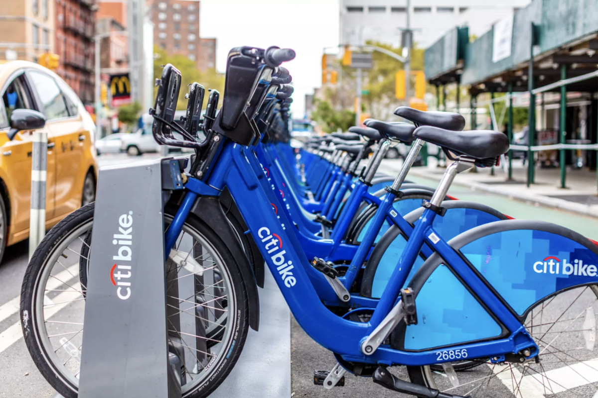
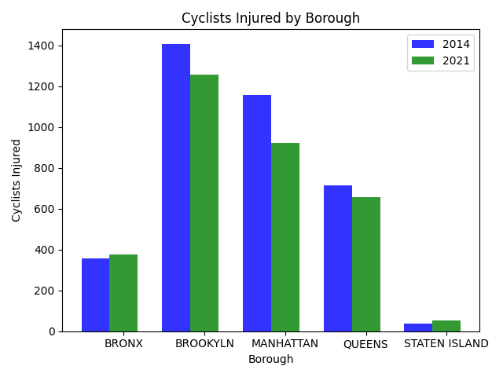

Hi and welcome to my Data Science project on Biking trends in NYC. I want to start by thanking Citi Bike because this project was mainly focused around data that they publish. I did this project to analyze how Biking has evolved in NYC mainly which parts of NYC is biking popular.

# Most Popular Bike Stations

Thanks to Citi Bike's data I managed to find the most popular bike stations. The following are the most popular stations in the year 2021:

<iframe src="2021map.html" height="500" width="500"></iframe>

Here are the most popular bike stations in 2014:

<iframe src="2014Map.html" height="500" width="500"></iframe>

As you can see the most popular bike stations are for the most part in Manhattan only one being outside of Manhattan for both years. So Manhattan is the borough that bikes the most by far. Even then the lower half of Manhattan bikes more than the upper half of Manhattan although you can see that in 2021 there are some popular bike stations in upper Manhattan compared to almost none in 2014

Here is a bar graph:

